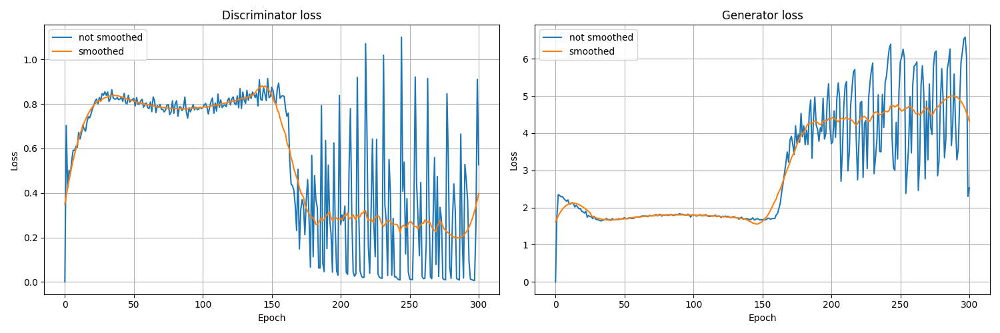

# Pix2Pix Facades

## Evaluation
### Generator and discriminator loss

### Discriminator Loss

### Discriminator Accuracy

### Generated images
Let's generate some images after training the GAN i.e. after 300 epochs.

### Generated images while training

