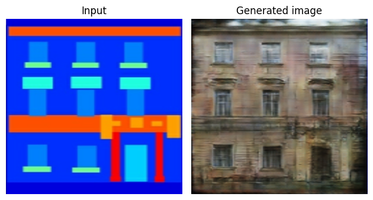
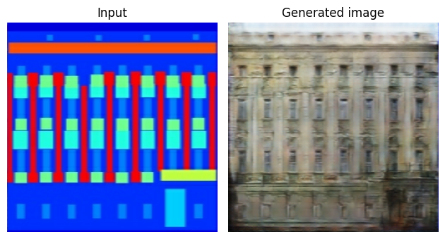

# Pix2Pix Facades

Based on the [Pix2Pix paper](https://arxiv.org/abs/1611.07004) a GAN was trained:
The generator takes a sketch/plan (drawing!) of a facade as input and generates a corresponding realistic-looking image of the facade as output.
The GAN was trained on [facades dataset](http://efrosgans.eecs.berkeley.edu/pix2pix/datasets/).








## Model

### Generator
```
Model: "generator"
_________________________________________________________________
 Layer (type)                Output Shape              Param #   
=================================================================
 down_sample_layer (DownSam  multiple                  3072      
 pleLayer)                                                       
                                                                 
 down_sample_layer_1 (DownS  multiple                  131584    
 ampleLayer)                                                     
                                                                 
 down_sample_layer_2 (DownS  multiple                  525312    
 ampleLayer)                                                     
                                                                 
 down_sample_layer_3 (DownS  multiple                  2099200   
 ampleLayer)                                                     
                                                                 
 down_sample_layer_4 (DownS  multiple                  4196352   
 ampleLayer)                                                     
                                                                 
 down_sample_layer_5 (DownS  multiple                  4196352   
 ampleLayer)                                                     
                                                                 
 down_sample_layer_6 (DownS  multiple                  4196352   
 ampleLayer)                                                     
                                                                 
 down_sample_layer_7 (DownS  multiple                  4196352   
 ampleLayer)                                                     
                                                                 
 up_sample_layer (UpSampleL  multiple                  4196352   
 ayer)                                                           
                                                                 
 up_sample_layer_1 (UpSampl  multiple                  8390656   
 eLayer)                                                         
                                                                 
 up_sample_layer_2 (UpSampl  multiple                  8390656   
 eLayer)                                                         
                                                                 
 up_sample_layer_3 (UpSampl  multiple                  8390656   
 eLayer)                                                         
                                                                 
 up_sample_layer_4 (UpSampl  multiple                  4195328   
 eLayer)                                                         
                                                                 
 up_sample_layer_5 (UpSampl  multiple                  1049088   
 eLayer)                                                         
                                                                 
 up_sample_layer_6 (UpSampl  multiple                  262400    
 eLayer)                                                         
                                                                 
 conv2d_transpose_7 (Conv2D  multiple                  6147      
 Transpose)                                                      
                                                                 
=================================================================
Total params: 54425865 (207.62 MB)
Trainable params: 54414979 (207.58 MB)
Non-trainable params: 10886 (42.52 KB)
_________________________________________________________________
```


### Discriminator

```
Model: "discriminator"
_________________________________________________________________
 Layer (type)                Output Shape              Param #   
=================================================================
 down_sample_layer_8 (DownS  multiple                  6144      
 ampleLayer)                                                     
                                                                 
 down_sample_layer_9 (DownS  multiple                  131584    
 ampleLayer)                                                     
                                                                 
 down_sample_layer_10 (Down  multiple                  525312    
 SampleLayer)                                                    
                                                                 
 conv2d_11 (Conv2D)          multiple                  2097152   
                                                                 
 batch_normalization_16 (Ba  multiple                  2048      
 tchNormalization)                                               
                                                                 
 leaky_re_lu_11 (LeakyReLU)  multiple                  0         
                                                                 
 zero_padding2d (ZeroPaddin  multiple                  0         
 g2D)                                                            
                                                                 
 conv2d_12 (Conv2D)          multiple                  8193      
                                                                 
=================================================================
Total params: 2770443 (10.57 MB)
Trainable params: 2768641 (10.56 MB)
Non-trainable params: 1802 (7.04 KB)
_________________________________________________________________
```

## Evaluation
### Generator and discriminator loss


### Discriminator Loss


### Discriminator Accuracy


### Generated images
Let's generate some images after training the GAN i.e. after 300 epochs.


### Generated images while training


